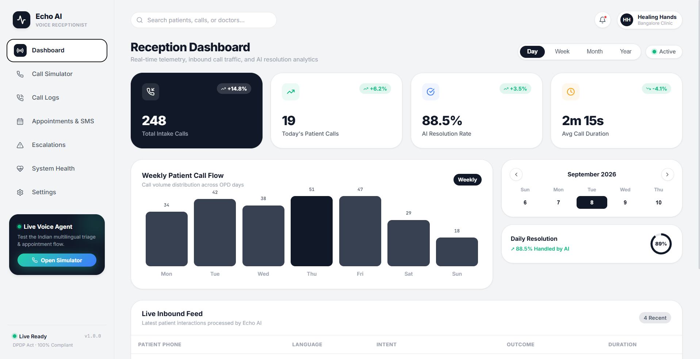
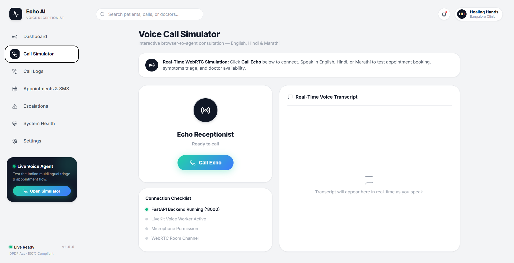
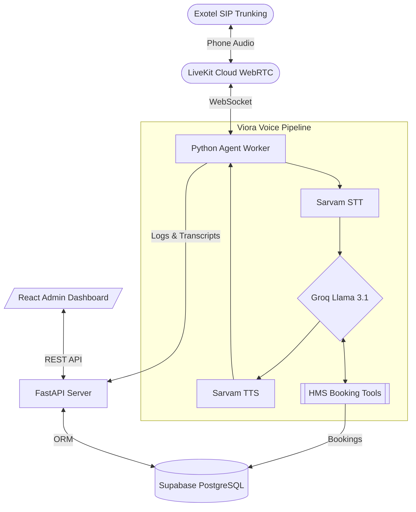

# Viora – Intelligent Voice Receptionist for Healthcare

<p align="center">
  
  
  
  
  
  
  
</p>

> **Viora** is a high-performance, inbound AI voice receptionist purpose-built for healthcare clinics and hospitals. It handles front-desk phone operations end-to-end — appointment scheduling, patient intake, symptom triage, lab report queries, and prescription status — in English, Hindi, and Marathi with native code-switching support.

---

## 🖥️ Clinic Receptionist & Admin Dashboard

<p align="center">
  
  <br>
  <em>Reception Telemetry Dashboard: Real-time patient call volume (248 intake calls), 88.5% AI resolution rate, weekly OPD call flow distribution, and live inbound feed.</em>
</p>

<p align="center">
  
  <br>
  <em>Voice Call Simulator: Interactive WebRTC consultation room (English, Hindi & Marathi), backend health checklist, and real-time live voice transcript panel.</em>
</p>

---

## ✨ Features

| Feature | Details |
|---|---|
| **Multilingual** | English · Hindi · Marathi + Hinglish code-switching |
| **Natural conversation** | Barge-in, adaptive silence, empathy injection, filler words |
| **Appointment management** | Book · Cancel · Reschedule via real-time HMS data |
| **Symptom triage** | ICMR-aligned risk scoring, red-flag detection |
| **Emergency escalation** | Keyword detection in all 3 languages → immediate transfer + 108 advisory |
| **Lab & prescription** | Real-time status lookup from HMS |
| **DPDP Compliant** | Spoken consent, immutable audit log, 7-day audio retention |
| **Admin dashboard** | Live monitor, call log, transcript viewer, escalation queue, system health |
| **HMS-agnostic** | Plug in Eka Care, Practo, or any EHR via the adapter interface |
| **Free-first stack** | Runs fully in demo mode without any API keys |

---

## 🏗️ Architecture



---

## 🚀 Quick Start (Windows)

```batch
# 1. Clone
git clone https://github.com/Vishwazeer/Viora.git
cd Viora

# 2. Install everything
INSTALL.bat

# 3. Add your API keys to .env (optional – runs in demo mode without them)
notepad .env

# 4. Start the project
Run_Project.bat
```

Dashboard opens at **http://localhost:5173**  
API docs at **http://localhost:8000/docs**

---

## 🐳 Docker (Production)

```bash
cp .env.example .env
# Fill in your API keys in .env
docker compose up -d
```

---

## 🔑 API Keys Required (for full functionality)

| Service | Purpose | How to get |
|---|---|---|
| `SARVAM_API_KEY` | STT + TTS (Indian languages) | [sarvam.ai](https://sarvam.ai) → Free ₹1K credits |
| `GEMINI_API_KEY` | LLM reasoning | [aistudio.google.com](https://aistudio.google.com) → Free tier |
| `LIVEKIT_*` | Real-time audio pipeline | [livekit.io](https://livekit.io) → Free cloud |
| `EXOTEL_*` | Indian phone numbers (SIP) | [exotel.com](https://exotel.com) → Free trial |
| `EKA_*` | EHR integration | `hub.eka.care` → API Tokens |

> **Without any keys:** The system runs in demo mode with mock data. All dashboard features work.

---

## 📁 Project Structure

```
Viora/
├── agent/
│   ├── core/           # Pipeline, language router, sentiment, escalation
│   ├── hms/            # HMS adapters (Mock + Eka Care)
│   ├── tools/          # Appointments, lab reports, triage, FAQ, registration
│   ├── prompts/        # System prompts (EN/HI/MR)
│   └── worker.py       # LiveKit agent entrypoint
├── api/
│   ├── routes/         # Webhooks, dashboard API, admin
│   └── middleware/     # Auth, consent, audit log
├── config/             # Settings, emergency keywords, clinic config
├── dashboard/          # React admin dashboard (Vite)
├── db/                 # SQLAlchemy models and sessions
├── tests/              # pytest suite
├── docker-compose.yml
├── Dockerfile
├── INSTALL.bat
├── UNINSTALL.bat
└── Run_Project.bat
```

---

## 🧪 Running Tests

```bash
# Activate venv first
.venv\Scripts\activate

# Run all tests
pytest tests/ -v

# With coverage
pytest tests/ --cov=agent --cov-report=term-missing
```

---

## 🌐 Supported Languages

| Language | STT | TTS | Emergency Detection | System Prompt |
|---|---|---|---|---|
| English (en-IN) | ✅ | ✅ (Meera) | ✅ | ✅ |
| Hindi (hi-IN) | ✅ | ✅ (Pavithra) | ✅ | ✅ |
| Marathi (mr-IN) | ✅ | ✅ (Arvind) | ✅ | ✅ |

---

## ⚕️ DPDP Act Compliance

- **Spoken consent** captured at call start
- **Immutable audit log** (`audit_events` table — never updated or deleted)
- **Audio retention**: 7 days (configurable)
- **Transcript retention**: 365 days (configurable)
- **Data erasure**: Patient can request full data deletion
- All data processed on **Indian infrastructure**

---

## 📈 Cost Estimates (Free → Production)

| Scale | Cost / month |
|---|---|
| Development / Demo | **₹0** (all mock, no API calls) |
| ~100 calls/day | ~₹3,000–4,000 |
| ~500 calls/day | ~₹12,000–15,000 |
| Funded scale (1000+/day) | Upgrade Sarvam → Deepgram, upgrade to enterprise-tier models |

---

## 🤝 Contributing

PRs welcome. Please open an issue first for major changes.

---

© 2026 Viora Health Technologies. All Rights Reserved.
