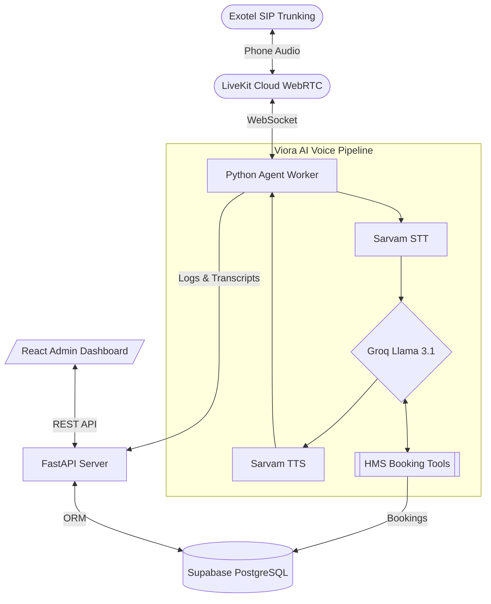

# 🎙️ The Viora Voice AI Journey: From Simulation to Production-Ready

This document tells the story of how **Viora**—the AI Voice Receptionist for **Healing Hands Clinic**—grew from a local simulation into a production-ready, low-latency, DPDP-compliant voice agent. 

Here is the narrative of our challenges, refactors, breakthroughs, and the ultimate technical state.

---

## 🗺️ The Starting Point: The Vision & Architecture

The goal was to build a highly natural, multilingual (English, Hindi, Marathi) voice assistant that patients could call to book appointments, check clinic services, and query doctor schedules. It needed to feel premium, achieve sub-second latency, and strictly comply with clinical and data governance standards.

---

## ⚡ Step 1: Solving the Voice Latency Bottleneck

Our earliest blocker was response latency. The original stack used `GeminiLLM`, which, while intelligent, was too slow for a real-time phone conversation (often taking 2-3 seconds to generate a stream).

### The Breakthrough:
*   **Swapped LLM Providers:** We migrated from the native `GeminiLLM` to the `openai.LLM` plugin, but pointed it directly at **Groq LPUs** (`llama-3.1-8b-instant`).
*   **Results:** Latency crashed to **sub-100ms** response times, allowing natural voice flow, conversational barge-ins, and natural interruption handling.

---

## 🗣️ Step 2: The Sarvam TTS "Warmup" 400 Bad Request

During testing, the LiveKit pipeline frequently failed during warmup with a generic `400 Bad Request` from the Text-to-Speech API.

### The Mystery:
The pipeline warmed up before application settings were loaded, causing it to fall back to a hardcoded default voice `"meera"` inside `SarvamTTSOptions`. This voice was incompatible with the underlying `bulbul:v2` model in the region.

### The Fix:
*   Standardized the base plugin defaults in `sarvam_tts.py` to use `vidya` (which is fully supported by Bulbul v2).
*   Added defensive logging in the TTS synthesis loop to catch network drops instantly.

---

## 💾 Step 3: Establishing the Supabase Data Persistence

A clinic assistant is useless without persistent memory. We transitioned from an ephemeral database to a production-grade cloud-hosted **Supabase PostgreSQL** instance.

### The DB Architecture:
1.  **Patient Ledger:** Core demographics and health cards.
2.  **Call Logs & Transcripts:** Detailed tracking of every voice stream.
3.  **Consent Ledger & Immutable Audit Logs:** Strict DPDP-act compliant logging that tracks spoken consent and clinical audits (non-updatable, non-deletable).
4.  **Appointments Table (Added):** To hold patient bookings, doctors, dates, times, and status.
5.  **SMS Audit Logs (Added):** To store simulated SMS notifications that would fire via Exotel in production.

*To ensure a seamless deployment, we configured database URL parameters to handle complex password characters (URL-encoding) and resolved Windows event loop conflicts (`ProactorEventLoop`) during standard migrations.*

---

## 🛠️ Step 4: Building the Clinic Tools & System Prompt

We taught the agent to act as a representative of the **Healing Hands Clinic** by wiring 5 custom tools directly into the LLM’s toolkit:

*   `get_clinic_info`: General clinic details, location (MG Road, Koramangala), and hours.
*   `list_doctors`: Fetches the live doctor roster (Dr. Priya Sharma, Dr. Rajan Mehta, etc.) with departments, fees, and shifts.
*   `check_doctor_availability`: Checks day-to-day slots.
*   `book_appointment`: Locks a booking into Supabase and creates an SMS notification.
*   `cancel_appointment`: Handles cancellation requests safely.

We also designed a strict **System Prompt** instructing the agent to keep responses short (1-3 sentences), warm, conversational, and to immediately trigger emergency protocols (directing to 112/108) if red flags like chest pain or breathing issues are detected.

---

## 📊 Step 5: The Appointments & SMS Dashboard

To make bookings testable and visual, we designed and built a beautiful addition to the React Admin Dashboard:

*   Created the `/appointments` backend routes to serve active lists, stats, and a demo SMS log.
*   Designed the **Appointments & SMS Demo** page (`Appointments.jsx`) on the frontend to display newly booked patients and their outbound confirmation SMS templates in real-time.
*   *Vite Import Fix:* We initially imported icons from `@heroicons`, causing a build mismatch. We successfully refactored the page to use native `lucide-react` icons, resolving the compilation issues immediately.

---

## 🧪 Step 6: The "Green Tick" CI/CD Refactor

To prepare the repository for standard deployments and collaborative development, we resolved a series of styling and security check failures:

1.  **Ruff (Python Linting):** Cleaned up unused imports, organized module imports, and placed `# noqa: E402` exceptions to allow setting paths and loading `.env` prior to importing LiveKit configurations.
2.  **ESLint (JS Linting):** Removed unused variables (`ParticipantEvent`, `publication`, etc.) and cleaned up double imports in `Simulator.jsx`.
3.  **Bandit (Security Scans):** Handled a security warning regarding binding the API server to `0.0.0.0` by marking it with `# nosec B104` to declare it as a deliberate deployment binding.

*The repository now successfully achieves a **clean build and test pass** on Github Actions.*

---

## 📈 The Core Architecture & Costs

### Architecture Flow:

### Production Cost Structure:
*   **Variable Cost:** ~**₹4.00 - ₹5.00 ($0.05 - $0.06)** per calling minute.
*   **Fixed Costs:** ~**₹1,700 - ₹5,000 ($20 - $60)** per month (comprising Railway hosting, Exotel number rentals, and Supabase database plans).

---

## 🏁 The Current Production-Ready State

Viora is fully stabilized:
1.  **Low Latency Voice Pipeline** runs cleanly in local dev or containers.
2.  **Supabase PostgreSQL** is populated with all DPDP structures, ready to track appointments.
3.  **FastAPI & Dashboard** are fully interactive with a live appointments visualizer.
4.  **CI/CD Pipeline** is completely green and ready for scale!

